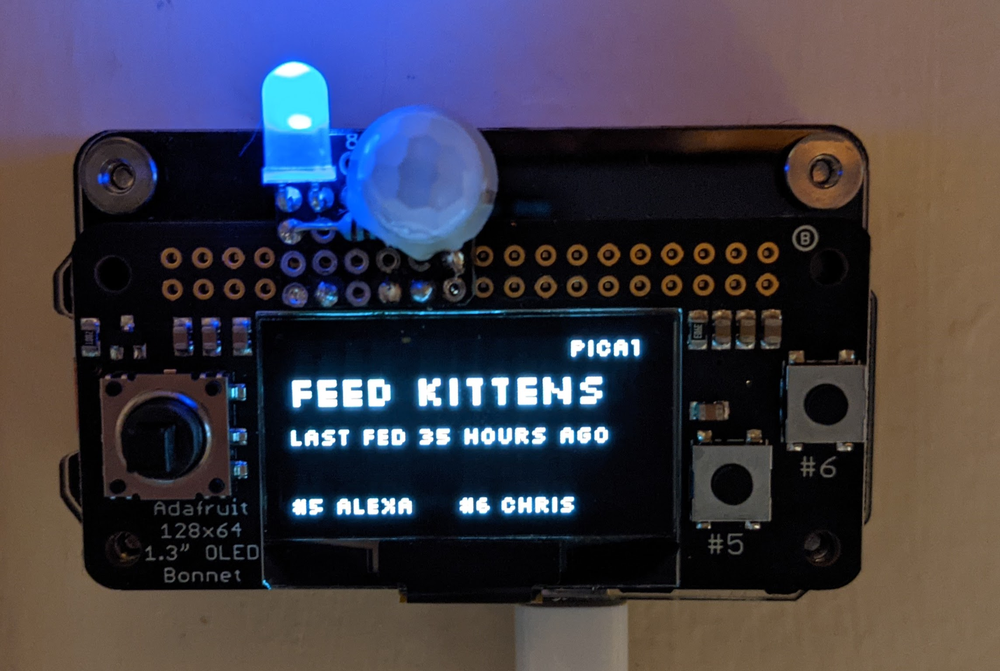

# PiCat Project
So, this project is full of not-so-good python code, but the goal is to create a device that can be stuck to a wall that shows when you last fed some cats.

## Usage
1. Pressing the joystick in any direction switches to a different view.
2. The #5 and #6 button will record a feeding from different people. This can be edited at the top of the script file.

There are only two views:
1. Screen that shows whether cats need food and the last feed time.
2. Screen that shows whether cats need food and the last 3 feeds.

## Tunables
The following can be set either during the setup script or /usr/local/picat/scripts/picat.conf
* NAME1: Name of first person
* NAME2: Name of second person
* SCREEN\_SLEEP\_SEC: Amount of inactivity before turning screen off
* HOURS\_BETWEEN\_FEEDS: How many second to wait to switch to "feed" mode.
* LED_PIN: Which GPIO pin to use for the LED output
* PIR_PIN: Which pin to use for a PIR motion sensor

## Hardware Used For Project
Specific hardware was used for this project, and most of the code is dependent on it.

* [Rapberry Pi Zero WH](https://www.adafruit.com/product/3708)
* [Adafruit 128x64 OLED Bonnet](https://www.adafruit.com/product/3531)
* [PIR Motion Sensor](https://www.adafruit.com/product/4871) (optional)
* LED & resistor (optional)
* A case of your choosing. i.e. [Adafruit Pi Zero Case](https://www.adafruit.com/product/3252) or [C4 Labs Zebra Zero](https://www.c4labs.com/product/zebra-zero-case-raspberry-pi-zero-zero-w-color-and-upgrade-options/)

## Setup
There is a setup directory with setup.sh that will handle all of the setup.

For the Pi itself, I would recommend Pi Lite OS with a [headless setup](https://www.raspberrypi.org/documentation/computers/configuration.html#setting-up-a-headless-raspberry-pi)

Don't forget to set your hostname and password!
* sudo vi /etc/hostname
* passwd

You may also want to edit the system timezone to your local time with sudo raspi-config.

## OLED Bonnet
Note: The OLED bonnet uses the following GPIO pins (not physical pin numbers)
* GPIO 5 = ButtonA
* GPIO 6 = ButtonB
* GPIO 17 = Joystick Up
* GPIO 22 = Joystick Down
* GPIO 27 = Joystick Left
* GPIO 23 = Joystick Right
* GPIO 4 = Joystick center

Personally, I messed up and soldered my LED AND motion sensor to already used pins because I thought the above were physical pin numbers. So for mine, I need to manually disable joystick up/down :(

## Credits
* raspi-blinka.sh from Adafruit.
* [Silkscreen Font](https://github.com/topfunky/sparklines/tree/master/fonts/silkscreen)
